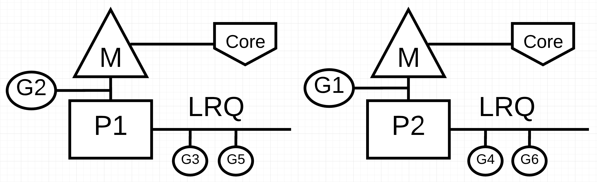

# Планирование в Go: Часть III — Конкурентность

Это третья статья из серии, состоящей из трёх частей, в которой мы рассмотрим механику и семантику планировщика в Go. Эта статья посвящена конкурентности.

## Введение

Когда я решаю какую-либо проблему, особенно если это новая проблема, я изначально не задумываюсь о том, подходит ли мне конкурентность или нет. Сначала я ищу последовательное решение и убеждаюсь, что оно работает. Затем, после проверки читабельности и технических характеристик, я начинаю задавать вопрос о целесообразности и практичности конкурентности. Иногда очевидно, что конкурентность хорошо подходит, а иногда это не так однозначно.

[В первой части](https://habr.com/ru/articles/478168/) этой серии я рассказал о механике и семантике планировщика ОС, которые, по моему мнению, важны, если вы планируете писать многопоточный код. [Во второй части](https://habr.com/ru/articles/489862/) я объяснил семантику планировщика Go, которая, на мой взгляд, важна для понимания того, как писать конкурентный код на Go. В этом посте я начну объединять механику и семантику планировщиков ОС и Go, чтобы обеспечить более глубокое понимание того, что такое конкурентность и что ей не является.

Цели этого поста следующие:

- Предоставить рекомендации по семантике, которую необходимо учитывать, чтобы определить, подходит ли рабочая нагрузка для использования конкурентности.
- Показать, как различные типы рабочих нагрузок меняют семантику и, следовательно, инженерные решения, которые необходимо принимать.

## Что такое конкурентность (concurrency)

Конкурентность означает выполнение "не по порядку". Взяв набор инструкций, которые в противном случае выполнялись бы последовательно, можно найти способ выполнить их не по порядку и получить тот же результат. Для рассматриваемой проблемы должно быть очевидно, что выполнение не по порядку добавит ценности. Когда я говорю "ценность", я имею в виду достаточный выигрыш в производительности по сравнению с затратами на сложность. В зависимости от вашей проблемы, выполнение команд в произвольном порядке может быть невозможным или даже не иметь смысла.

Важно также понимать, что [конкурентность - это не то же самое, что параллелизм](https://blog.golang.org/concurrency-is-not-parallelism) (parallelism). Параллелизм означает одновременное выполнение двух или более инструкций. Это понятие отличается от понятия конкурентности. Параллелизм возможен только в том случае, если вам доступны как минимум 2 потока ОС/железа, и у вас есть как минимум 2 горутины, каждая из которых выполняет инструкции независимо в каждом потоке ОС/железа.



На рис. 1 представлена схема двух логических процессоров (P), каждый из которых имеет свой независимый поток ОС (M), подключенный к независимому аппаратному потоку (Core) на машине. Видно, что две горутины (G1 и G2) работают параллельно, выполняя свои инструкции в соответствующем потоке ОС/железа одновременно. Внутри каждого логического процессора три горутины поочередно делят между собой соответствующий поток ОС/железа. Все эти горутины работают в режиме конкурентности, выполняя свои инструкции в произвольном порядке и деля время в потоке ОС/железа.

Вот в чём сложность: иногда использование конкурентности без параллелизма может замедлить производительность. Интересно также то, что иногда использование конкурентности с параллелизмом не даёт большего прироста производительности, чем вы могли бы предположить.

## Рабочие нагрузки

Как определить, когда возможно или имеет смысл выполнять вне очереди? Для начала необходимо понять, с каким типом рабочей нагрузки связана ваша проблема. Существует два типа рабочих нагрузок, которые важно понимать при рассмотрении вопроса о конкурентности.

- **CPU-Bound**: Это рабочая нагрузка, которая никогда не создает ситуации, в которой горутина естественным образом переходит в состояние ожидания и выходит из него. Это работа, которая постоянно производит вычисления. Поток, вычисляющий число Pi с точностью до N-го знака, будет CPU-Bound.
- **IO-Bound**: Это рабочая нагрузка, которая заставляет горутины естественным образом входить в состояние ожидания. Это работа, заключающаяся в запросе доступа к ресурсу по сети, выполнении системных вызовов операционной системы или ожидании наступления какого-либо события. Гороутина, которой необходимо прочитать файл, будет IO-Bound. К этой категории я бы отнёс и события синхронизации (мьютексы, атомарность), которые заставляют горутину ждать.

Для вычислительных задач, связанных с использованием процессора (CPU-Bound), необходим параллелизм для использования конкурентности. Один поток ОС/железа, обслуживающий несколько горутин, неэффективен, поскольку горутины не переходят в состояние ожидания и не выходят из него в рамках своей рабочей нагрузки. Наличие большего количества горутин, чем потоков ОС/железа, может замедлить выполнение рабочей нагрузки из-за затрат времени на переключение горутин на поток ОС/железа и обратно. Переключение контекста создает событие "Stop The World" для вашей рабочей нагрузки, поскольку ни одна из ваших рабочих нагрузок не выполняется во время переключения, когда в противном случае она могла бы быть выполнена.

Для задач, связанных с вводом-выводом (IO-Bound), вам не требуется использовать параллелизм для использования конкурентности. Один поток ОС/железа может эффективно обрабатывать несколько горутин, поскольку горутины естественным образом переходят в состояние ожидания и выходят из него в рамках своей рабочей нагрузки. Наличие большего числа горутин, чем потоков ОС/железа, может ускорить выполнение рабочей нагрузки, поскольку затраты на задержку при перемещении горутин в поток ОС/железа и обратно не создают события "Stop The World". Рабочая нагрузка естественным образом останавливается, и это позволяет другой горутине эффективно использовать тот же самый поток ОС/железа вместо того, чтобы позволить потоку ОС/железа простаивать.

Как определить, какое количество горутин на один аппаратный поток обеспечивает наилучшую пропускную способность? Слишком мало горутин - больше времени простоя. Слишком большое количество горутин приводит к увеличению времени задержки при переключении контекста. Об этом стоит подумать, но это выходит за рамки данной статьи.

Пока же важно просмотреть некоторый код, чтобы укрепить вашу способность определить, может ли рабочая нагрузка использовать конкурентность, или нет, и нужен ли параллелизм или нет.

## Добавление чисел

Для визуализации и понимания этой семантики нам не нужен сложный код. Посмотрите на следующую функцию `add`, которая суммирует коллекцию целых чисел.

### Listing 1

https://play.golang.org/p/r9LdqUsEzEz


В листинге 1 в строке 36 объявлена функция `add`, которая принимает коллекцию целых чисел и возвращает сумму этой коллекции. Она начинается в строке 37 с объявления переменной `v`, которая будет содержать сумму. Затем в строке 38 функция линейно обходит коллекцию и каждое число добавляет к текущей сумме в строке 39. Наконец, в строке 41 функция возвращает итоговую сумму вызывающей стороне.

Вопрос: является ли функция `add` рабочей нагрузкой, которая подходит для выполнения в произвольном порядке? Я считаю, что ответ положительный. Коллекцию целых чисел можно разбить на более мелкие списки и обрабатывать их конкурентно. После того как все меньшие списки будут просуммированы, набор сумм можно сложить, чтобы получить тот же ответ, что и в последовательном варианте.

Однако здесь возникает другой вопрос. Сколько меньших списков должно быть создано и обработано независимо друг от друга, чтобы получить наилучшую пропускную способность? Чтобы ответить на этот вопрос, необходимо знать, какую нагрузку выполняет функция `add`. Функция `add` выполняет рабочую нагрузку CPU-Bound, поскольку алгоритм выполняет чисто математические действия, и ничто из того, что он делает, не заставит горутину перейти в естественное состояние ожидания. Это означает, что для обеспечения хорошей пропускной способности достаточно использовать одну горутину на один поток ОС/железа.

В листинге 2 ниже приведена моя конкурентная версия `add`.

_Примечание: При написании конкурентной версии add можно использовать несколько способов и вариантов. Не стоит зацикливаться на моей конкретной реализации. Если у вас есть более удобочитаемая версия, которая работает так же или лучше, я буду рад, если вы поделитесь ею._

### Listing 2

https://play.golang.org/p/r9LdqUsEzEz


В Листинге 2 представлена функция `addConcurrent`, которая представляет собой конкурентную версию функции `add`. В конкурентной версии используется 26 строк кода, в то время как в неконкурентной версии - 5 строк. Кода очень много, поэтому я выделю только важные для понимания строки.

Строка 48: Каждая горутина получает свой уникальный, но меньший по размеру список чисел для сложения. Размер списка вычисляется путем взятия размера коллекции и деления его на количество горутин.

Строка 53: Создаётся пул горутин для выполнения работы по сложению.

Строки 57-59: Последняя горутина добавит оставшийся список чисел, который может быть больше, чем у других горутин.

Строка 66: Сумма меньших списков суммируется в итоговую сумму.

конкурентный вариант, безусловно, сложнее последовательного, но стоит ли эта сложность того? Лучший способ ответить на этот вопрос - создать бенчмарк. Для этих тестов я использовал коллекцию из 10 миллионов чисел с выключенным сборщиком мусора. Есть последовательная версия, использующая функцию `add`, и конкурентная версия, использующая функцию `addConcurrent`.

### Listing 3

```go
func BenchmarkSequential(b *testing.B) {
	for i := 0; i < b.N; i++ {
		add(numbers)
	}
}

func BenchmarkConcurrent(b *testing.B) {
	for i := 0; i < b.N; i++ {
		addConcurrent(runtime.NumCPU(), numbers)
	}
}
```

В листинге 3 приведены бенчмарк-функции. Здесь приведены результаты, когда для всех горутин доступен только один поток ОС/железа. Последовательная версия использует 1 горутину, а конкурентная версия - `runtime.NumCPU` или 8 горутин на моей машине. В этом случае конкурентная версия использует конкурентность без параллелизма.

### Listing 4

```
10 Million Numbers using 8 goroutines with 1 core
2.9 GHz Intel 4 Core i7
Concurrency WITHOUT Parallelism
-----------------------------------------------------------------------------
$ GOGC=off go test -cpu 1 -run none -bench . -benchtime 3s
goos: darwin
goarch: amd64
pkg: github.com/ardanlabs/gotraining/topics/go/testing/benchmarks/cpu-bound
BenchmarkSequential      	    1000	   5720764 ns/op : ~10% Faster
BenchmarkConcurrent      	    1000	   6387344 ns/op
BenchmarkSequentialAgain 	    1000	   5614666 ns/op : ~13% Faster
BenchmarkConcurrentAgain 	    1000	   6482612 ns/op
```

_Примечание: Выполнение бенчмарка на локальной машине является сложной задачей. Существует множество факторов, которые могут привести к неточности результатов. Убедитесь, что ваша машина работает как можно меньше, и прогоните бенчмарки несколько раз. Вы должны убедиться, что результаты совпадают. Дважды прогнав бенчмарк с помощью инструмента тестирования, можно добиться наиболее стабильных результатов._

В листинге 4 показано, что версия Sequential примерно на 10-13% быстрее, чем Concurrent, когда для всех горутин доступен только один поток ОС/железа. Этого и следовало ожидать, поскольку в конкурентном варианте возникают накладные расходы на контекстные переключения в этом единственном потоке ОС/железа и управление горутинами.

Вот результаты, когда для каждой горутины доступен отдельный поток ОС/железа. Последовательная версия использует 1 горутину, а конкурентная - `runtime.NumCPU` или 8 горутин на моей машине. В данном случае конкурентная версия использует конкурентность с параллелизмом.

### Listing 5

```
10 Million Numbers using 8 goroutines with 8 cores
2.9 GHz Intel 4 Core i7
Concurrency WITH Parallelism
-----------------------------------------------------------------------------
$ GOGC=off go test -cpu 8 -run none -bench . -benchtime 3s
goos: darwin
goarch: amd64
pkg: github.com/ardanlabs/gotraining/topics/go/testing/benchmarks/cpu-bound
BenchmarkSequential-8        	    1000	   5910799 ns/op
BenchmarkConcurrent-8        	    2000	   3362643 ns/op : ~43% Faster
BenchmarkSequentialAgain-8   	    1000	   5933444 ns/op
BenchmarkConcurrentAgain-8   	    2000	   3477253 ns/op : ~41% Faster
```

Бенчмарк в листинге 5 показывает, что конкурентная версия примерно на 41-43% быстрее последовательной, когда для каждой горутины доступен отдельный поток ОС/железа. Этого и следовало ожидать, поскольку все горутины теперь работают параллельно, восемь горутин выполняют свою конкурентную работу одновременно.

## Сортировка

Важно понимать, что не для всех рабочих нагрузок CPU-bound подходит конкурентность. В первую очередь это касается тех случаев, когда разбиение работы на части и/или объединение всех результатов обходится очень дорого. В качестве примера можно привести алгоритм Bubble-сортировки. Посмотрите на следующий код, реализующий Bubble-сортировку в Go.

### Listing 6

https://play.golang.org/p/S0Us1wYBqG6

```go
package main

import "fmt"

func bubbleSort(numbers []int) {
	n := len(numbers)
	for i := 0; i < n; i++ {
		if !sweep(numbers, i) {
			return
		}
	}
}

func sweep(numbers []int, currentPass int) bool {
	var idx int
	idxNext := idx + 1
	n := len(numbers)
	var swap bool

	for idxNext < (n - currentPass) {
		a := numbers[idx]
		b := numbers[idxNext]
		if a > b {
			numbers[idx] = b
			numbers[idxNext] = a
			swap = true
		}
		idx++
		idxNext = idx + 1
	}
	return swap
}

func main() {
	org := []int{1, 3, 2, 4, 8, 6, 7, 2, 3, 0}
	fmt.Println(org)

	bubbleSort(org)
	fmt.Println(org)
}
```

В листинге 6 приведен пример Bubble-сортировки, написанный на языке Go. Этот алгоритм сортировки проходит через коллекцию целых чисел, меняя значения местами при каждом проходе. В зависимости от упорядоченности списка может потребоваться несколько проходов по коллекции, прежде чем всё будет отсортировано.

Вопрос: является ли функция `bubbleSort` рабочей нагрузкой, которая подходит для выполнения в произвольном порядке? Я считаю, что ответ на этот вопрос отрицательный. Коллекцию целых чисел можно разбить на более мелкие списки и сортировать их конкурентно. Однако после выполнения всей конкурентной работы нет эффективного способа отсортировать меньшие списки вместе. Приведём пример конкурентной версии Bubble-сортировки.

### Listing 8


В Листинге 8 представлена функция `bubbleSortConcurrent`, которая представляет собой конкурентную версию функции `bubbleSort`. Она использует несколько горутин для одновременной сортировки частей списка. Однако в итоге у вас остается список отсортированных значений в блоках. Учитывая список из 36 чисел, разделённых на группы по 12, это будет результирующий список, если весь список не будет снова отсортирован на строке 25.

### Listing 9

```
Before:
  25 51 15 57 87 10 10 85 90 32 98 53
  91 82 84 97 67 37 71 94 26  2 81 79
  66 70 93 86 19 81 52 75 85 10 87 49

After:
  10 10 15 25 32 51 53 57 85 87 90 98
   2 26 37 67 71 79 81 82 84 91 94 97
  10 19 49 52 66 70 75 81 85 86 87 93
```

Поскольку природа Bubble-сортировки заключается в прочёсывании списка, вызов `bubbleSort` в строке 25 сведёт на нет все потенциальные преимущества использования конкурентности. В случае Bubble-сортировки, использование конкурентности не даёт никакого выигрыша в производительности.

## Чтение файлов

Две рабочие нагрузки CPU-bound были представлены, но как насчёт рабочих нагрузок IO-Bound? Отличается ли семантика, когда горутина естественным образом переходит в состояние ожидания и выходит из него? Рассмотрим рабочую нагрузку IO-Bound, которая читает файлы и выполняет текстовый поиск.

Эта первая версия представляет собой последовательную версию функции `find`.

### Listing 10

https://play.golang.org/p/8gFe5F8zweN


В листинге 10 представлена последовательная версия функции `find`. В строке 43 объявляется переменная `found`, которая ведёт подсчет количества раз, когда заданная тема (аргумент `topic`) встречается в данном документе. Затем в строке 44 выполняется итерация документов, и каждый документ считывается в строке 45 с помощью функции `read`. Наконец, в строках 49-53 используется функция `Contains` из пакета `strings` для проверки того, может ли тема быть найдена в коллекции элементов, считанных из документа. Если тема найдена, то переменная `found` увеличивается на единицу.

Вот реализация функции `read`, которая вызывается функцией `find`.

### Listing 11

https://play.golang.org/p/8gFe5F8zweN


Функция `read` в листинге 11 начинается с вызова `time.Sleep` на одну миллисекунду. Этот вызов используется для имитации задержки, которая могла бы возникнуть, если бы мы выполнили реальный системный вызов для чтения документа с диска. Согласованность этой задержки важна для точного измерения производительности последовательной версии `find` по сравнению с конкурентной. Затем в строках 35-39 макет xml-документа, хранящийся в глобальной переменной `file`, разгруппировывается в значение `struct` для обработки. Наконец, в строке 39 вызывающей стороне возвращается коллекция элементов.

С последовательной версией разобрались, теперь перейдём к конкурентной.

_Примечание: При написании конкурентной версии find можно использовать несколько способов и вариантов. Не стоит зацикливаться на моей конкретной реализации. Если у вас есть более удобочитаемая версия, которая работает так же или лучше, я буду рад, если вы поделитесь ею._

### Listing 12

https://play.golang.org/p/8gFe5F8zweN


В Листинге 12 представлена функция `findConcurrent`, которая представляет собой конкурентную версию функции `find`. В конкурентной версии используется 30 строк кода по сравнению с 13 строками кода в неконкурентной версии. Целью реализации конкурентной версии было управление количеством горутин, которые используются для обработки неизвестного количества документов. Я выбрал паттерн pooling, в котором канал используется для подачи пула горутин.

Кода очень много, поэтому я выделю только важные для понимания строки.

Строки 61-64: Создаётся канал и заполняется всеми документами для обработки.

Строка 65: Канал закрывается, чтобы пул горутин естественным образом завершился, когда все документы будут обработаны.

Строка 70: Создаётся пул горутин.

Строки 73-83: Каждая горутина в пуле получает документ из канала, считывает его в память и проверяет содержимое на соответствие теме. При обнаружении совпадения увеличивается локальная переменная `found`.

Строка 84: Сумма индивидуальных подсчётов горутин суммируется в итоговый подсчёт.

Конкурентная версия, безусловно, сложнее последовательной, но стоит ли эта сложность того? Лучший способ ответить на этот вопрос - создать бенчмарк. Для этих тестов я использовал коллекцию из 1 тыс. документов с выключенным сборщиком мусора. Есть последовательная версия, использующая функцию `find`, и конкурентная версия, использующая функцию `findConcurrent`.

### Listing 13

```go
func BenchmarkSequential(b *testing.B) {
	for i := 0; i < b.N; i++ {
		find("test", docs)
	}
}

func BenchmarkConcurrent(b *testing.B) {
	for i := 0; i < b.N; i++ {
		findConcurrent(runtime.NumCPU(), "test", docs)
	}
}
```

В листинге 13 приведены бенчмарк-функции. Здесь приведены результаты, когда для всех горутин доступен только один поток ОС/железа. Последовательная версия использует 1 горутину, а конкурентная - `runtime.NumCPU` или 8 горутин на моей машине. В данном случае конкурентная версия использует конкурентность без параллелизма.

### Listing 14

```
10 Thousand Documents using 8 goroutines with 1 core
2.9 GHz Intel 4 Core i7
Concurrency WITHOUT Parallelism
-----------------------------------------------------------------------------
$ GOGC=off go test -cpu 1 -run none -bench . -benchtime 3s
goos: darwin
goarch: amd64
pkg: github.com/ardanlabs/gotraining/topics/go/testing/benchmarks/io-bound
BenchmarkSequential      	       3	1483458120 ns/op
BenchmarkConcurrent      	      20	 188941855 ns/op : ~87% Faster
BenchmarkSequentialAgain 	       2	1502682536 ns/op
BenchmarkConcurrentAgain 	      20	 184037843 ns/op : ~88% Faster
```

Бенчмарк в листинге 14 показывает, что конкурентная версия примерно на 87-88% быстрее последовательной, когда для всех горутин доступен только один поток ОС/железа. Этого и следовало ожидать, поскольку все горутины эффективно используют один поток ОС/железа. Естественное переключение контекста, происходящее для каждой горутины при вызове `read`, позволяет выполнять больше работы на одном потоке OS/hardware.

Вот бенчмарк при использовании конкурентности с параллелизмом.

### Listing 15

```
10 Thousand Documents using 8 goroutines with 1 core
2.9 GHz Intel 4 Core i7
Concurrency WITH Parallelism
-----------------------------------------------------------------------------
$ GOGC=off go test -run none -bench . -benchtime 3s
goos: darwin
goarch: amd64
pkg: github.com/ardanlabs/gotraining/topics/go/testing/benchmarks/io-bound
BenchmarkSequential-8        	       3	1490947198 ns/op
BenchmarkConcurrent-8        	      20	 187382200 ns/op : ~88% Faster
BenchmarkSequentialAgain-8   	       3	1416126029 ns/op
BenchmarkConcurrentAgain-8   	      20	 185965460 ns/op : ~87% Faster
```

Бенчмарк в листинге 15 показывает, что привлечение дополнительных потоков ОС/железа не даёт прироста производительности.

## Заключение

Целью данной статьи было дать рекомендации по семантике, которую необходимо учитывать, чтобы определить, подходит ли рабочая нагрузка для использования конкурентности. Я постарался привести примеры различных типов алгоритмов и рабочих нагрузок, чтобы вы могли увидеть различия в семантике и различные инженерные решения, которые необходимо учитывать.

Вы можете ясно видеть, что для рабочих нагрузок IO-Bound, параллелизм не нужен, чтобы получить большой прирост производительности. Иначе обстоит дело с рабочими нагрузками CPU-Bound. Когда речь идёт об алгоритме типа Bubble-сортировки, использование конкурентности добавляет сложности без какого-либо реального выигрыша в производительности. Важно определить, подходит ли ваша рабочая нагрузка для использования конкурентности, а затем определить тип рабочей нагрузки, чтобы использовать правильную семантику.
